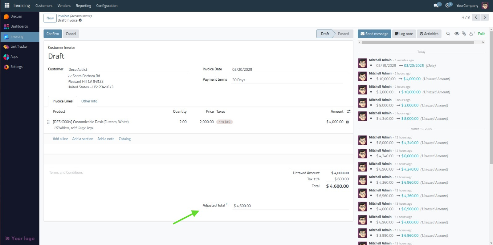

# Inventory Quantity Adjustment Module for Odoo 18

## 📌 Overview
This Odoo 18 module allows users to adjust inventory quantities seamlessly within the accounting module. The module integrates with `account.move` to ensure accurate stock adjustments while maintaining financial records.

## 🚀 Features
- Automatic inventory quantity adjustments from invoices.
- Seamless integration with the Odoo accounting system.
- Custom menu and views for better usability.

## 🛠️ Installation
1. Clone the repository:
   ```bash
   git clone https://github.com/ahmed-reda-301/odoo_addons_inv_qty_adjust.git
   ```
2. Copy the module folder (`inv_qty_adjust_module`) to your Odoo addons directory.
3. Restart your Odoo server:
   ```bash
   ./odoo-bin -c odoo.conf -u inv_qty_adjust_module
   ```
4. Activate developer mode and install the module from the Odoo Apps menu.

## 📝 Usage
1. Navigate to **Accounting** > **Invoices**.
2. Create or open an invoice with products.
3. Once validated, the module will automatically adjust the inventory quantity.

## 📂 Module Structure
```
inv_qty_adjust_module/
│── models/
│   ├── __init__.py
│   ├── account_move.py
│── views/
│   ├── account_move_view.xml
│   ├── menu.xml
│── static/description/
│   ├── icon.png
│── __init__.py
│── __manifest__.py
```

## 🖼️ Screenshots


## 🤝 Contributing
Feel free to fork the repository and submit pull requests for improvements.

## 📩 Contact
For any inquiries or support, reach out via LinkedIn or GitHub.

---
🔗 **GitHub Repository:** [odoo_addons_inv_qty_adjust](https://github.com/ahmed-reda-301/odoo_addons_inv_qty_adjust)
